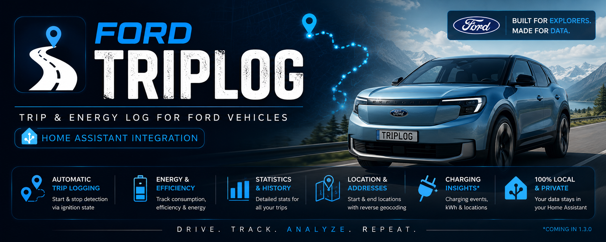
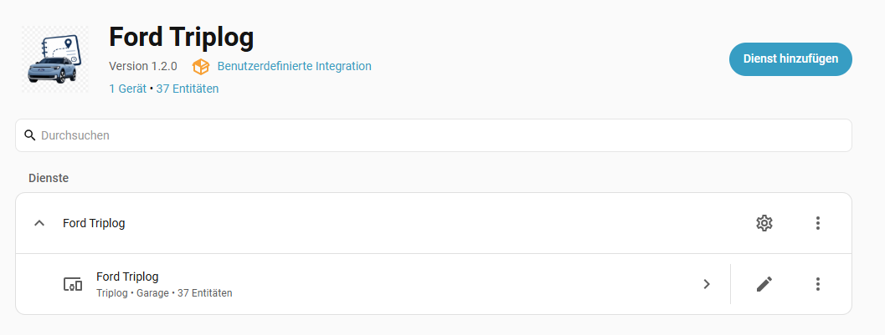
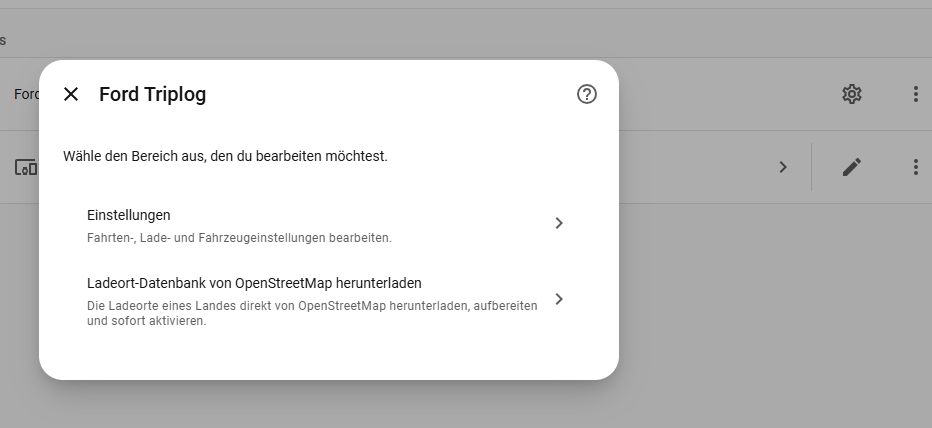
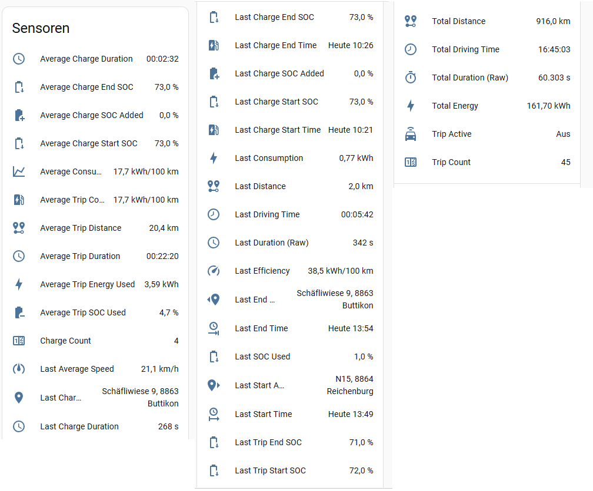
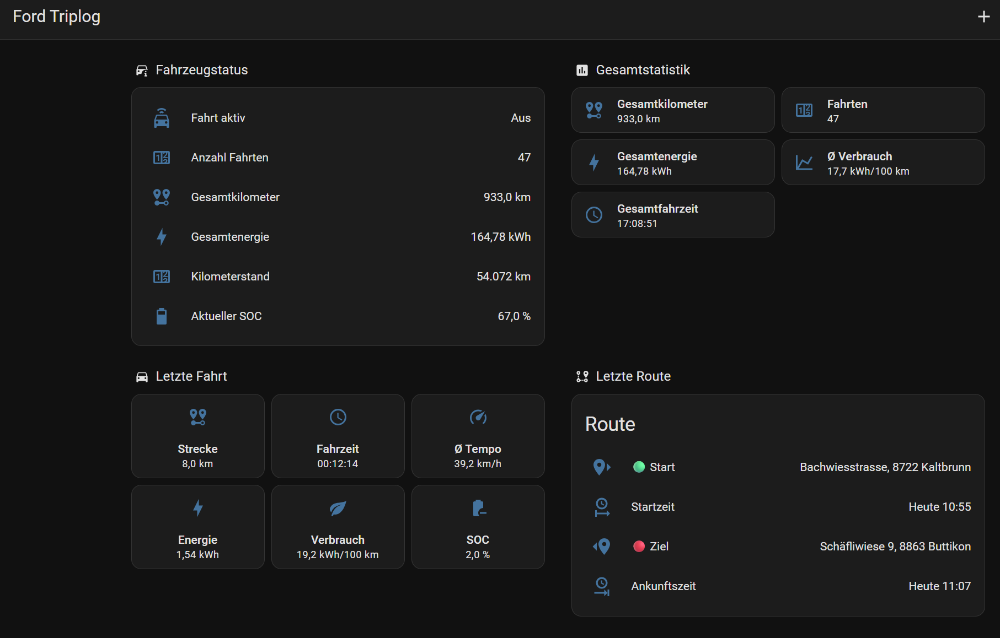

<p align="center">
  
</p>

<h1 align="center">Ford Triplog</h1>

<p align="center">
<b>Automatic Trip & Energy Logging for Ford vehicles in Home Assistant</b>
</p>

<p align="center">
  
  
  
  
  
</p>

---

## Why Ford Triplog?

The official FordPass integration provides vehicle data, but it does not maintain a complete trip history.

**Ford Triplog extends FordPass** by automatically recording every journey and exposing detailed trip statistics through native Home Assistant entities.

### Highlights

- 🚗 Automatic trip detection
- ⚡ Automatic charging detection
- 📍 Start & destination addresses
- 🔋 Battery usage (SOC)
- ⚡ Energy consumption (kWh)
- 🔌 Charging history
- 📈 Driving & charging statistics
- 💾 Automatic recovery after Home Assistant restart
- 🏠 100% local data storage
- 🔧 Native Home Assistant integration


---

# Screenshots

## Integration



*Ford Triplog integrates seamlessly into Home Assistant through Config Flow.*

## Options



*Smart Trip automatically merges short stops into a single trip.*

## Sensors



*Native Home Assistant sensors provide detailed information about your last trip and overall driving statistics.*

---

# Features

| Trips | Charging | Statistics | Home Assistant |
|---|---|---|---|
| Automatic trip detection | Automatic charge detection | Trip statistics | Config Flow |
| Smart Trip | Charge history | Charging statistics | Options Flow |
| Start & End Address | Charge Address | Average Consumption | Native Sensors |
| Start & End SOC | Start & End SOC | Average Charge Duration | Local Storage |
| Driving Time | Charging Duration | Trip Count | Recovery |
| Distance | SOC Added | Charge Count | Local Branding |
| Energy Used | Charging History | Average SOC | |

---

# Installation

## HACS *(coming soon)*

1. Add the Ford Triplog repository.
2. Install **Ford Triplog**.
3. Restart Home Assistant.
4. Add the integration from **Settings → Devices & Services**.

## Manual Installation

```text
custom_components/
└── ford_triplog/
```

Copy the folder into your Home Assistant configuration directory and restart Home Assistant.

---

# Sensors

## Last Trip

| Sensor | Unit |
|---|---|
| Last Start Address | — |
| Last End Address | — |
| Last Distance | km |
| Last Driving Time | formatted |
| Last Duration (Raw) | s |
| Last Start SOC | % |
| Last End SOC | % |
| Last SOC Used | % |
| Last Consumption | kWh |
| Last Efficiency | kWh/100 km |
| Last Average Speed | km/h |
| Last Start Time | — |
| Last End Time | — |

## Last Charging Session

| Sensor | Unit |
|---|---|
| Last Charge Address | — |
| Last Charge Start Time | — |
| Last Charge End Time | — |
| Last Charge Duration | formatted |
| Last Charge Start SOC | % |
| Last Charge End SOC | % |
| Last Charge SOC Added | % |


## Statistics

| Sensor | Unit |
|---|---|
| Trip Count | trips |
| Charge Count | charges |
| Total Distance | km |
| Total Energy | kWh |
| Total Driving Time | formatted |
| Average Trip Distance | km |
| Average Trip Duration | formatted |
| Average Trip Energy | kWh |
| Average Consumption | kWh/100 km |
| Average Trip SOC Used | % |
| Average Charge Duration | formatted |
| Average Charge Start SOC | % |
| Average Charge End SOC | % |
| Average Charge SOC Added | % |

---

## Example Dashboard



*Example Home Assistant dashboard created with the included Ford Triplog sensors.  
This dashboard is provided as inspiration only and is not part of the integration.*

---
# What's New in 1.2.0

## Added

### Charging

- Automatic charging detection
- Charging history
- Charging recovery after Home Assistant restart
- Local charging storage
- Last charge cache

### New Charging Sensors

- Last Charge Address
- Last Charge Start Time
- Last Charge End Time
- Last Charge Duration
- Last Charge Start SOC
- Last Charge End SOC
- Last Charge SOC Added

### New Trip Sensors

- Last Trip Start SOC
- Last Trip End SOC
- Last Trip SOC Used

### Statistics

- Charge Count
- Average Charge Duration
- Average Charge Start SOC
- Average Charge End SOC
- Average Charge SOC Added
- Average Trip Distance
- Average Trip Duration
- Average Trip Energy Used
- Average Trip Consumption
- Average Trip SOC Used

## Improved

- Statistics engine
- Recovery handling
- Local storage
- Address formatting
- Sensor naming
- Home Assistant SensorStateClass support

## Fixed

- Statistics calculation
- Storage consistency
- Sensor update reliability
- Recovery handling

## Next

### Smart Charging

- Integrate charging stops into trips
- Automatic trip continuation after charging
- Detect charging pauses
- AC/DC charging detection
- Charged energy (kWh)
- Named charging locations

### Trip Analytics

- Trip ↔ Charging correlation
- Charging time per trip
- Improved trip statistics

---

# FAQ

### Does Ford Triplog replace FordPass?

No. It extends the official FordPass integration with comprehensive trip logging and statistics.

### Where is my data stored?

All trip data remains stored locally inside your Home Assistant instance.

### Does it support multiple vehicles?

Not yet. Multi-vehicle support is planned.

---

# Support

Ford Triplog is developed in my spare time.

If you enjoy using the integration and would like to support future development:

**☕ Ko-fi**

https://ko-fi.com/dompressor

Every contribution helps improve the project.

---

# Contributing

Bug reports, feature requests and pull requests are welcome.

---

# License

Released under the MIT License.
