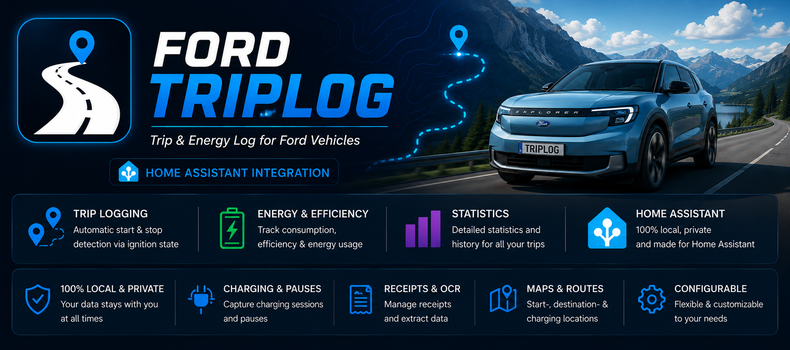

# Ford Triplog

<b>Automatic Trip & Charging History for Ford EVs in Home Assistant</b>

**Automatic Trip Logging • Journey Management • GPS Route Tracking • Daily History • Charging History • Smart Statistics • Intelligent Charging Location Recognition**

------------------------------------------------------------------------

Ford Triplog is a Home Assistant custom integration that automatically
records every trip and charging session of your Ford electric vehicle.

Built on top of the community-maintained FordPass integration, it
creates a permanent local driving history including detailed trip
statistics, charging history, GPS routes, energy calculations and
charging location recognition.

All data is stored locally inside Home Assistant.

No cloud backend.

No external database.

Your data always remains under your control.

------------------------------------------------------------------------

# Features

## 🚗 Automatic Trip Logging

- Automatic trip detection
- Start and end timestamps
- Distance travelled
- Driving duration
- Average speed
- State of Charge (SOC) consumption
- Estimated energy consumption
- Smart Trip support

## 🛣️ Journey Management

Ford Triplog automatically combines related trips and charging sessions into a single Journey.

Features include:

- Automatic Journey creation
- Automatic Journey rebuild
- Complete Journey timeline
- Multiple trips per Journey
- Multiple charging sessions per Journey
- Pause detection
- Home-zone based Journey completion
- Configurable timeout and maximum gap
- Native Journey sensor
- Local timezone support
- Rich dashboard attributes
- Journey energy balance
- Start and end battery state
- Battery energy flow calculation
- Charging cost summary
- Average charging price

------------------------------------------------------------------------

## 🕓 Daily History

Ford Triplog 2.0.1 adds a shared date-based History view for stored driving and charging data.

Features include:

- Shared History date selection
- Daily Journey history
- Daily Route history
- Daily Charging history
- Charging-only days
- Charging receipt access
- Synchronized History sensors
- Home Assistant local calendar dates

------------------------------------------------------------------------

## ⏸️ Pause Management

Detected pauses can be enriched with additional information.

Features include:

- Title
- Category
- Location
- Notes
- Costs
- Manual editing
- Journey timeline integration

------------------------------------------------------------------------

## 🛰️ Route Tracker

Ford Triplog provides optional GPS route recording for individual trips.

The Route Tracker records position points from a separate Home Assistant position source and links the resulting route to the corresponding Trip ID.

Features include:

- Automatic start and stop together with the Trip
- Support for ABRP latitude/longitude entities
- Support for Home Assistant Companion App position data
- Persistent route storage
- Smart Trip pause and resume support
- Automatic recovery after Home Assistant restart or integration reload
- Trip start and end GPS points as route endpoints
- Native Last Route sensor
- Native Route History sensor
- GeoJSON route output for Home Assistant maps
- Historical routes by selected date
- Raw GPS points are always preserved

Route tracking is optional and independent from the normal Ford Triplog vehicle tracker.

------------------------------------------------------------------------

## 🗺️ Optional OSRM Route Matching

Ford Triplog can optionally use a local OSRM server to match recorded GPS points to the road network.

This is especially useful when the selected GPS source provides only a limited number of position updates.

Features include:

- Configurable local OSRM server
- Configurable matching radius
- Automatic matching after trip completion
- Raw and matched route data stored separately
- Matching diagnostics
- Manual rebuild of the latest route
- No dependency on a public routing service

OSRM is completely optional. Without OSRM, Ford Triplog continues to store and display the recorded raw GPS route.

A DACH example for Germany, Austria and Switzerland is available in:

`examples/osrm/`

------------------------------------------------------------------------

## 🔋 Charging History

Automatically records every charging session including:

- Charging duration
- Start and end SOC
- Estimated charged energy
- Charging location
- Charging provider
- Linked trip (when available)
- Journey integration
- Charging station recognition
- Manual charging cost editor
- Seasonal home charging tariffs
- Energy billed by charging provider
- Charging loss calculation
- Energy delivered vs. billed
- Detailed charging cost breakdown
- Automatic home charging cost calculation
- Receipt management
- Multiple receipts per charging session
- PDF and image receipt upload
- Optional OCR support
- OCR parser profiles
- Date-based Charging History sensor

------------------------------------------------------------------------

## 🧾 Receipt Management

Ford Triplog can manage charging receipts directly inside Home Assistant.

Features include:

- PDF and image receipt upload
- Multiple receipts per charging session
- Receipt browser
- Open stored receipts
- Open receipts from the History dashboard
- Delete receipts
- OCR integration (optional)
- User parser profiles
- Automatic charging data extraction

------------------------------------------------------------------------

## 📍 Intelligent Charging Location Recognition

Charging locations are resolved automatically using multiple sources.

Priority order:

1. Home Assistant zones
2. FordPass charging information
3. Local OpenStreetMap charging database
4. Address fallback

------------------------------------------------------------------------

## 📊 Statistics

Ford Triplog continuously maintains:

- Trip statistics
- Charging statistics
- Lifetime statistics
- Energy consumption
- Average efficiency
- Native Home Assistant sensors
- Journey energy balance
- Journey charging costs
- Average charging price
- Battery energy delta
- Total battery energy flow

------------------------------------------------------------------------

# Requirements

- Home Assistant 2026.6 or newer
- HACS
- FordPass Home Assistant integration
- Python 3.12+

------------------------------------------------------------------------

# Installation

Ford Triplog is installed through HACS.

See the complete installation guide:

➡ **[Installation Guide](docs/installation.md)**

------------------------------------------------------------------------

## Dashboard Examples

Ready-to-use Home Assistant dashboard examples are available in:

`docs/examples/`

Examples include:

- Vehicle overview
- Last Trip
- Last Charge
- Last Journey
- Journey timeline
- Last Route map
- History date selection
- Journey History
- Route History map
- Charging History
- Charging receipt History
- Charging cost overview
- Journey energy balance

The **Route History map** example requires these HACS custom cards:

- **Google Map Card**
- **Config Template Card**

The Route History map can be hidden automatically when the selected day contains no route data.

Simply copy the example configuration into Home Assistant and adjust the entity IDs to match your installation.

------------------------------------------------------------------------

# Roadmap

## Version 2.x

- Top statistics and additional statistical sensors
- Advanced journey editing
- Additional dashboard examples and statistics
- Multi-vehicle enhancements
- Optional SQLite acceleration layer
- Long-term history improvements

Complete roadmap:

➡ **[ROADMAP.md](ROADMAP.md)**

------------------------------------------------------------------------

# Contributing

Bug reports, feature requests and pull requests are welcome.

Contribution guide:

➡ **[CONTRIBUTING.md](CONTRIBUTING.md)**

------------------------------------------------------------------------

# Support

If Ford Triplog is useful to you, consider supporting future development.

➡ **[Buy me a Coffee](https://ko-fi.com/dompressor)**

Every contribution helps improving the project.

------------------------------------------------------------------------

# Changelog

See:

➡ **[CHANGELOG.md](CHANGELOG.md)**

Release information:

➡ **[RELEASE_NOTES.md](RELEASE_NOTES.md)**

------------------------------------------------------------------------

# Help translate Ford Triplog

Want to see Ford Triplog in your native language?

New translations and improvements to existing ones are always welcome. Simply submit a Pull Request with your translation files.

Every contribution helps make Ford Triplog more accessible to the Home Assistant community. Thank you!

------------------------------------------------------------------------

# License

Ford Triplog is released under the MIT License.

See **LICENSE** for details.

------------------------------------------------------------------------

# Disclaimer

Ford Triplog is an independent community project.

It is not affiliated with or endorsed by Ford Motor Company.

Ford®, FordPass® and all related trademarks belong to their respective owners.

------------------------------------------------------------------------

# Made for the Home Assistant Community ❤️

If you like Ford Triplog, consider giving the project a ⭐ on GitHub.
