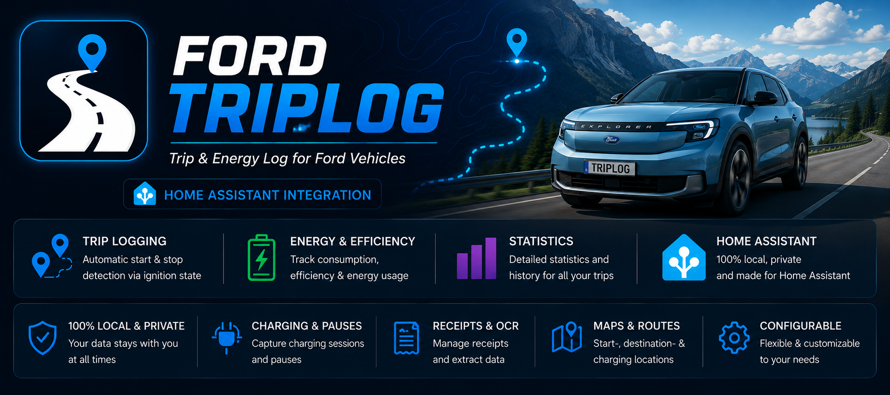

# Ford Triplog



<p align="center">
<b>Automatic Trip & Charging History for compatible EV data sources in Home Assistant</b>
</p>

<p align="center">


</p>

<p align="center">

**Automatic Trip Logging • Journey Management • GPS Route Tracking • Daily History • Charging History • Smart Statistics • Intelligent Charging Location Recognition**

------------------------------------------------------------------------

Ford Triplog is a Home Assistant custom integration that automatically
records trips and charging sessions from compatible vehicle entities.

Ford Triplog remains Ford-focused. Version 2.6 builds on the production
multi-vehicle architecture from 2.5 and adds vehicle master data, documents,
warranty tracking, a per-vehicle cost/TCO module and SQLite-backed configuration
recovery. Each configured vehicle keeps its own local Trips, charging sessions,
Journeys, Routes, costs and related history while the shared dashboard entities
can switch between loaded vehicles.

For Ford vehicles, Ford Connect is the recommended vehicle data source.
Compatible FordPass entities can still be used where available. Other
Home Assistant vehicle sources can also be used when they expose compatible
entities; Ford-specific features such as automatic physical plug-state
detection are only enabled for supported Ford sources.

All data is stored locally inside Home Assistant.

No cloud backend.

No external database.

Your data always remains under your control.

------------------------------------------------------------------------

# Features

## 🚙 Multi-Vehicle Support

Ford Triplog 2.6 supports multiple configured vehicles in one local Triplog database.

Features include:

- Stable internal `vehicle_id` per vehicle
- VIN/device-based vehicle identity discovery where available
- Vehicle-scoped Trips, charging sessions, Journeys and Routes
- Vehicle-scoped current/last state and related metadata
- Shared Ford Triplog vehicle selector for dashboard/history context
- Vehicle-aware options and manual actions
- Existing dashboard entity IDs remain stable instead of being duplicated for every vehicle
- Existing pre-2.5 data is migrated to the original vehicle automatically

The multi-vehicle layer is entity-based. Ford Connect remains the recommended
source for Ford vehicles, while other compatible Home Assistant vehicle
sources can be used when they expose the required states.

------------------------------------------------------------------------

## 🚗 Automatic Trip Logging

- Automatic trip detection
- Start and end timestamps
- Distance travelled
- Driving duration
- Average speed
- State of Charge (SOC) consumption
- Estimated energy consumption
- Smart Trip support

## 🛣️ Journey Management

Ford Triplog automatically combines related trips and charging sessions into a single Journey.

Features include:

- Automatic Journey creation
- Automatic Journey rebuild
- Complete Journey timeline
- Multiple trips per Journey
- Multiple charging sessions per Journey
- Pause detection
- Home-zone based Journey completion
- Configurable timeout and maximum gap
- Native Journey sensor
- Local timezone support
- Rich dashboard attributes
- Journey energy balance
- Start and end battery state
- Battery energy flow calculation
- Charging cost summary
- Average charging price

------------------------------------------------------------------------

## 🕓 Daily History

Ford Triplog provides a shared date-based History view for stored driving and charging data.

Features include:

- Shared History date selection
- Daily Journey history
- Daily Route history
- Daily Charging history
- Charging-only days
- Charging receipt access
- Pause receipt access
- Synchronized History sensors
- Home Assistant local calendar dates

------------------------------------------------------------------------

## ⏸️ Pause Management

Detected pauses can be enriched with additional information.

Features include:

- Title
- Category
- Location
- Notes
- Costs
- Manual editing
- Receipt upload and management
- Multiple receipts per pause
- Receipt access from the selected History date
- Journey timeline integration

------------------------------------------------------------------------

## 🛰️ Route Tracker

Ford Triplog provides optional GPS route recording for individual trips.

The Route Tracker records position points from a separate Home Assistant position source and links the resulting route to the corresponding Trip ID.

Features include:

- Automatic start and stop together with the Trip
- Support for ABRP latitude/longitude entities
- Support for Home Assistant Companion App Geocoded Location
- Direct Home Assistant `device_tracker` GPS support
- High-accuracy Companion App route recording when the selected tracker provides frequent updates
- Persistent route storage
- Smart Trip pause and resume support
- Automatic recovery after Home Assistant restart or integration reload
- Trip start and end GPS points as route endpoints
- Native Last Route sensor
- Native Route History sensor
- GeoJSON route output for Home Assistant maps
- Explicit route start/end and geometric-centre coordinates
- Map-compatible `latitude` / `longitude` point to the route start
- Historical routes by selected date
- Raw GPS points are always preserved
- Vehicle/auxiliary-GPS consistency guard at Trip completion
- Detached phone/device-tracker routes are discarded when they disagree with vehicle GPS by more than 250 m

Route tracking is optional and independent from the normal Ford Triplog vehicle tracker.
When the auxiliary Route Tracker is not travelling with the vehicle, Ford Triplog keeps the vehicle GPS authoritative instead of storing an implausible phantom route.

------------------------------------------------------------------------

## 🗺️ Optional OSRM Route Matching

Ford Triplog can optionally use a local OSRM server to match recorded GPS points to the road network.

This is especially useful when the selected GPS source provides only a limited number of position updates.

Features include:

- Configurable local OSRM server
- Configurable matching radius
- Automatic matching after trip completion
- Automatic chunking of dense traces that exceed common OSRM trace limits
- Overlapping chunk merge for continuous road geometry
- Raw and matched route data stored separately
- Matching diagnostics
- Route maintenance for rebuilding the latest, raw/failed or all stored routes
- No dependency on a public routing service

OSRM is completely optional. Without OSRM, Ford Triplog continues to store and display the recorded raw GPS route.

A DACH example for Germany, Austria and Switzerland is available in:

`docs/examples/osrm/`

------------------------------------------------------------------------

## 🔋 Charging History

Automatically records every charging session including:

- Charging duration
- Start and end SOC
- Estimated charged energy
- Charging location
- Charging provider
- Linked trip (when available)
- Journey integration
- Charging station recognition
- Manual charging cost editor
- Seasonal home charging tariffs
- Energy billed by charging provider
- Charging loss calculation
- Energy delivered vs. billed
- Detailed charging cost breakdown
- Automatic home charging cost calculation
- Receipt management
- Multiple receipts per charging session
- PDF and image receipt upload
- Optional OCR support
- OCR parser profiles
- Date-based Charging History sensor
- Automatic Ford physical plug-state discovery when supported
- One physical Ford charging session can survive `COMPLETED/READY -> IN_PROGRESS` resumes while the plug remains connected

------------------------------------------------------------------------

## 🧾 Receipt Management

Ford Triplog can manage receipts for charging sessions and Journey pauses directly inside Home Assistant.

Features include:

- PDF and image receipt upload
- Multiple receipts per charging session
- Multiple receipts per Journey pause
- Receipt browser
- Open stored receipts
- Open charging and pause receipts from the History dashboard
- Delete receipts
- OCR integration (optional)
- User parser profiles
- Automatic charging data extraction

------------------------------------------------------------------------

## 📍 Intelligent Charging Location Recognition

Charging locations are resolved automatically using multiple sources.

Priority order:

1. Home Assistant zones
2. Ford charging-session information, when available
3. Local OpenStreetMap charging database
4. Address fallback

------------------------------------------------------------------------

## 📤 CSV Export

Ford Triplog can export stored history data directly from the Home
Assistant options flow.

Available exports include:

- Trips
- Journeys
- Charging sessions
- Optional start/end date filtering
- Direct CSV download through Home Assistant

The exported files use practical flattened columns and can be used in
spreadsheet applications or external analysis tools.

------------------------------------------------------------------------

## 📊 Statistics

Ford Triplog continuously maintains:

- Trip statistics
- Charging statistics
- Lifetime statistics
- Energy consumption
- Average efficiency
- Native Home Assistant sensors
- Journey energy balance
- Journey charging costs
- Average charging price
- Battery energy delta
- Total battery energy flow
- Top Trip
- Top Journey
- Top Day
- Top Charging providers and locations
- Largest charging session
- Top Departures & Destinations
- Top Routes with trip count, average distance and average consumption
- Zone-aware and charging-site-aware location statistics
- Automatic Top Charging refresh after stored charging data or costs are changed

------------------------------------------------------------------------


## 💰 Vehicle Costs & TCO

Ford Triplog 2.6 adds a vehicle-scoped operating-cost and Total Cost of Ownership (TCO) module.

Cost areas include:

- Leasing / financing
- Insurance
- Road tax
- Service and maintenance
- Repairs
- Tyres / wear
- Care and accessories
- Vignettes and road tolls
- Other vehicle costs

Costs are stored per `vehicle_id` and allocated economically to the period they belong to. A payment date or payment cadence can still be stored for documentation, but it does not distort the TCO period.

The TCO overview combines:

- Financing
- Insurance
- Road tax
- Maintenance / repairs
- Tolls / vignettes
- Other vehicle costs
- Effective charging costs from the existing charging history
- Driven distance from the existing driving statistics

The dashboard-facing TCO sensor provides current-month totals, a rolling monthly breakdown, yearly summaries, fixed/variable cost totals and cost per kilometre. When distance is zero, cost per kilometre remains unavailable instead of dividing by zero.

Charging costs are not calculated a second time. Ford Triplog reuses the stored effective charging-session cost, so billed/receipt-derived charging values remain authoritative.

------------------------------------------------------------------------

## 📄 Vehicle Data, Documents & Warranty

Ford Triplog 2.6 can store vehicle master data and related documents independently for each vehicle.

Supported master data includes:

- VIN
- Registration number
- Make and model
- First registration
- Type approval
- Power
- Empty and gross weight

A registration document can be uploaded as PDF or image. When a usable PDF text layer or configured OCR service is available, Ford Triplog can prefill recognized values for review before they are saved.

Additional vehicle documents can be stored locally, including CoC/IVI, service documents, warranty proofs and other files.

Warranty tracking supports separate limits for:

- Vehicle warranty
- EV components
- High-voltage battery

The vehicle-details sensor combines stored master data, the live odometer where available and remaining warranty time/distance.

------------------------------------------------------------------------

## 🛟 Configuration Recovery

Ford Triplog 2.6 stores a recovery snapshot of each successfully loaded vehicle ConfigEntry in SQLite.

The snapshot contains the vehicle's source-entity mapping and relevant per-vehicle options. The Home Assistant ConfigEntry remains the live configuration; the SQLite copy is a recovery template only.

If a vehicle still exists in the Ford Triplog database but its ConfigEntry is missing, **Add Integration → Ford Triplog** offers **Recover vehicle configuration**. The saved vehicle can be selected and the ConfigEntry recreated while retaining its existing `vehicle_id` and stored history.

Global home tariffs are not duplicated into these snapshots, and automatically discovered Ford plug-state entities remain runtime-only.

------------------------------------------------------------------------
## 📍 User-defined Places

Ford Triplog 2.4 adds reusable places for automatically enriching Journey pauses.

A user-defined place can contain:

- Name
- Category
- Description
- Latitude / longitude
- Matching radius
- Optional MDI icon

Places can be created directly from an existing Journey pause. When a later pause occurs inside the configured radius, Ford Triplog can reuse the saved place information automatically.

Manual pause edits retain priority over automatically resolved place data.

------------------------------------------------------------------------

## ♻️ Recuperation and Monthly Statistics

Ford Triplog 2.4 extends energy and reporting data with SOC-based net recuperation and monthly summaries.

New statistics include:

- Recovered SOC per Trip
- SOC-derived net recuperated energy
- Total recuperation statistics
- Top recuperation Trip
- Monthly driving distance
- Monthly Trip and Journey counts
- Monthly driving time
- Monthly net battery energy
- Monthly average consumption
- Monthly Home / Work / External charging energy
- Monthly charging costs and session counts
- Rolling monthly history and yearly charging summaries
- CSV export for monthly driving and charging statistics

Recuperation values represent the net SOC gain over a complete Trip. They are not a measurement of all regenerative energy generated during the drive.

------------------------------------------------------------------------

## 📡 Vehicle Source Health

Ford Triplog 2.4 monitors the configured live vehicle-data source.

The source-health model distinguishes between:

- Healthy
- Degraded
- Grace period
- Unavailable
- Unknown

A complete outage is only declared when all monitored live source entities remain unavailable for 20 minutes.

Ford Triplog provides:

- A connectivity binary sensor for automations
- A translated status sensor for dashboards and badges
- Dynamic status icons
- One Home Assistant Persistent Notification per continuous outage
- Automatic reset after the source recovers

Short-lived or partial source outages therefore do not immediately create an alert.

------------------------------------------------------------------------

## 🧹 Maintenance Tools

Ford Triplog includes guarded maintenance functions for stored history.

- Clearly suspicious charging sessions can be selected and deleted
- Deletion requires explicit confirmation
- Dependent Journeys and statistics are rebuilt afterwards
- The stored last charging session is refreshed when required
- Existing receipt files are preserved when an invalid charging session
  is removed
- Journey rebuild runs in the background and prevents duplicate/queued maintenance runs
- Historical near-duplicate Trips are filtered deterministically during a full rebuild
- Short historical Trip/charging overlaps can be reconciled during maintenance when their locations match
- Stored GPS routes can be rebuilt through the configured OSRM server
- Route maintenance can rebuild the latest route, raw/failed routes or all routes
- Raw GPS points are preserved when matched route geometry is rebuilt

------------------------------------------------------------------------

## 🗃️ Local SQLite Storage

Ford Triplog 2.6 continues to use the SQLite-only storage architecture completed in 2.3 and extends it with vehicle-scoped cost, document and recovery data.

SQLite is the sole productive Ford Triplog datastore.

- New and changed Triplog records are written to SQLite
- Parallel JSON production writes are removed
- Existing JSON data remains available as a migration/import source
- Persistent migration markers prevent completed legacy imports from
  being scanned repeatedly after every Home Assistant restart
- Trips, charging sessions, Journeys, Routes, metadata, caches and
  statistics are read from the local SQLite database
- Vehicle identity is stored centrally and operational data is scoped by `vehicle_id`
- Existing pre-2.5 rows are migrated to the original vehicle context automatically
- Home charging tariff periods are stored globally in SQLite and shared across vehicle ConfigEntries
- Financing, insurance, road tax and variable vehicle expenses are stored per vehicle
- Vehicle master data, warranties and document metadata are stored per vehicle
- Successful ConfigEntry configurations are stored as SQLite recovery snapshots
- Raw GPS route points and OSRM-matched route geometry remain stored
  separately
- Receipt files remain on the Home Assistant filesystem and their
  metadata remains linked through Ford Triplog storage
- No external database service is required

The SQLite database is stored locally inside the Ford Triplog Home
Assistant storage directory.

Ford Triplog also persists active Route Tracker data periodically while a
Trip is running and force-saves it on important lifecycle transitions. This
reduces route loss after an unexpected Home Assistant interruption without
writing every individual GPS point directly to SQLite.

------------------------------------------------------------------------

# Requirements

- Home Assistant 2026.6 or newer
- HACS
- A compatible vehicle data integration exposing the required Home Assistant entities
  - Ford Connect is recommended for Ford vehicles
  - FordPass can be used where compatible entities are available
  - Other entity-based vehicle sources can be used when they expose compatible ignition, odometer, SOC, charging and position data
- Python 3.12+

------------------------------------------------------------------------

# Installation

Ford Triplog is installed through HACS.

See the complete installation guide:

➡ **[Installation Guide](docs/installation.md)**

## First Setup Notes

After installation, it is possible that vehicle or trip data is not
available immediately. Some source entities may temporarily show `0`,
`unknown` or `unavailable` while the configured vehicle integration is
starting.

Ford Triplog waits for valid numeric source values and ignores temporary
`unknown` / `unavailable` states. Drive the vehicle once after setup if the
vehicle integration has not yet published current telemetry.

Ford Connect is the recommended source for Ford vehicles. FordPass can
still be used where available, but it is a community-maintained unofficial
integration and can be affected by Ford backend changes. Ford Triplog 2.6 can
also use other compatible entity-based vehicle sources; Ford-specific
capabilities remain limited to supported Ford integrations.

Ford Triplog estimates Trip energy from the vehicle SOC change and the
configured **usable battery capacity**. New installations default to 77 kWh.
Verify this value in the integration settings for the actual vehicle/battery
variant, because an incorrect capacity directly scales the calculated kWh and
average kWh/100 km values.

------------------------------------------------------------------------

## Dashboard Examples

Ready-to-use Home Assistant dashboard examples are available in:

`docs/examples/`

Examples include:

- Vehicle overview
- Last Trip
- Last Charge
- Last Journey
- Journey timeline
- Last Route map
- History date selection
- Journey History
- Route History map
- Charging History
- Charging receipt History
- Pause receipt History
- Charging cost overview
- Vehicle TCO / cost overview
- Vehicle details and warranty
- Journey energy balance
- Top Departures & Destinations
- Top Routes

### OpenStreetMap / Leaflet route map

A simple Google-free option is the HACS **ha-map-card** (`custom:map-card`). Ford Triplog exposes map-ready GeoJSON directly on the Last Route and Route History sensors.

Example for Last Route:

```yaml
type: custom:map-card
card_size: 10
entities:
  - entity: sensor.your_ford_triplog_last_route
    geojson:
      attribute: geojson
      hide_marker: true
      color: "#ff0000"
      weight: 6
      opacity: 1
```

In 2.6 the route sensor's normal `latitude` / `longitude` attributes point to the first coordinate of the displayed route, so map cards that use the entity position open at the route start. The previous geometric centre remains available as `center_latitude` / `center_longitude`; explicit `start_*` and `end_*` coordinates are also exposed.

The existing **Google Map Card** + **Config Template Card** example remains an alternative for users who prefer that setup.

The Route History map can be hidden automatically when the selected day contains no route data.

Simply copy the example configuration into Home Assistant and adjust the entity IDs to match your installation.

------------------------------------------------------------------------

# Roadmap

## Version 2.6 – Released

- Per-vehicle vehicle costs and TCO
- Financing/leasing with smoothed economic allocation and document support
- Insurance and road-tax management
- Maintenance, repairs, toll/vignette and other vehicle expenses with optional receipts
- Monthly/yearly TCO reporting and cost per kilometre
- Effective charging costs reused from charging history
- Vehicle master data, documents and warranty tracking
- Registration-document and financing-document assisted import through PDF text/OCR where available
- SQLite-backed vehicle ConfigEntry recovery snapshots and recovery flow
- Route start/end/centre coordinates for Last Route and Route History
- Route map focus defaults to the route start
- Recuperation display-name cleanup

## Version 2.7 – Planned

- Route export and route-data portability
- Raw GPS export with timestamps
- GPX / GeoJSON export
- Optional enriched GPS metadata such as altitude, accuracy, speed and course
- Additional cost/reporting refinements based on 2.6 field experience

## 3.x – Research

- Manufacturer-neutral Triplog core with vehicle-specific adapters
- Read-only vehicle adapters beyond Ford where technically feasible
- Further separation of source-specific capabilities from the common Triplog core

Complete roadmap:

➡ **[ROADMAP.md](ROADMAP.md)**

------------------------------------------------------------------------

# Contributing

Bug reports, feature requests and pull requests are welcome.

Contribution guide:

➡ **[CONTRIBUTING.md](CONTRIBUTING.md)**

------------------------------------------------------------------------

# Support

If Ford Triplog is useful to you, consider supporting future development.

➡ **[Buy me a Coffee](https://ko-fi.com/dompressor)**

Every contribution helps improving the project.

------------------------------------------------------------------------

# Changelog

See:

➡ **[CHANGELOG.md](CHANGELOG.md)**

Release information:

➡ **[RELEASE_NOTES.md](RELEASE_NOTES.md)**

------------------------------------------------------------------------

# Help translate Ford Triplog

Want to see Ford Triplog in your native language?

New translations and improvements to existing ones are always welcome. Simply submit a Pull Request with your translation files.

Every contribution helps make Ford Triplog more accessible to the Home Assistant community. Thank you!

------------------------------------------------------------------------

# License

Ford Triplog is released under the MIT License.

See **LICENSE** for details.

------------------------------------------------------------------------

# Disclaimer

Ford Triplog is an independent community project.

It is not affiliated with or endorsed by Ford Motor Company.

Ford®, FordPass® and all related trademarks belong to their respective owners.

------------------------------------------------------------------------

# Made for the Home Assistant Community ❤️

If you like Ford Triplog, consider giving the project a ⭐ on GitHub.
