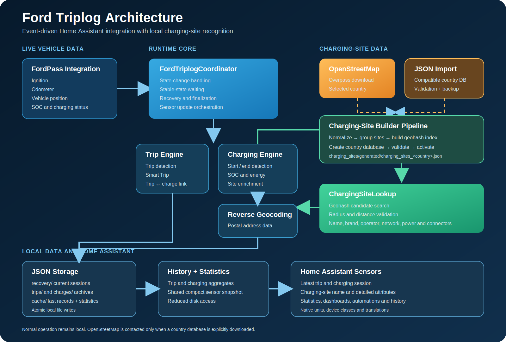

# Architecture

Ford Triplog is built around Home Assistant's recommended integration architecture.

The integration follows an event-driven design and uses a central coordinator to manage trip detection, charging detection, statistics, storage and sensor updates.

<p align="center">
  
</p>

## Overview

FordPass provides the vehicle entities used by Ford Triplog. The `ExplorerCoordinator` monitors those entities and controls the integration logic.

The coordinator delegates work to three main areas:

- Trip detection
- Charging detection
- Statistics processing

Completed records are written to local JSON storage. Active sessions can be restored after a Home Assistant restart. Home Assistant sensors expose the prepared values to dashboards, automations and history.

## Core components

### ExplorerCoordinator

The `ExplorerCoordinator` is the central component of the integration.

It is responsible for:

- monitoring FordPass entities
- detecting trips
- detecting charging sessions
- updating statistics
- writing JSON files
- restoring active sessions
- refreshing Home Assistant sensors

### Trip detection

Trip detection uses vehicle state changes and data from:

- ignition
- odometer
- vehicle position
- state of charge

Smart Trip prevents short stops from fragmenting one journey into multiple trips.

### Charging detection

Charging sessions are recorded independently from trips.

The coordinator records:

- charging start and end
- charging duration
- start and end SOC
- charging location
- estimated charged energy

### Statistics engine

Ford Triplog maintains aggregated statistics instead of repeatedly scanning the complete history for every sensor update.

This reduces disk access and keeps sensor updates responsive.

### Storage layer

Ford Triplog stores data as local JSON files:

```text
/config/.storage/ford_triplog/
├── trips/
├── charges/
├── statistics.json
├── last_trip.json
└── last_charge.json
```

### Active session recovery

Unfinished trips and charging sessions can be restored after a Home Assistant restart.

Completed history remains unaffected.

### Home Assistant sensors

Sensors receive prepared data from the coordinator and storage layer.

They expose:

- latest trip information
- latest charging information
- lifetime statistics
- translated entity names
- native Home Assistant units and device classes

## Design goals

Ford Triplog is designed around:

- reliability
- local data ownership
- transparent storage
- low disk activity
- native Home Assistant integration
- future extensibility

## Next step

See the troubleshooting guide:

[ Troubleshooting](troubleshooting.md)
